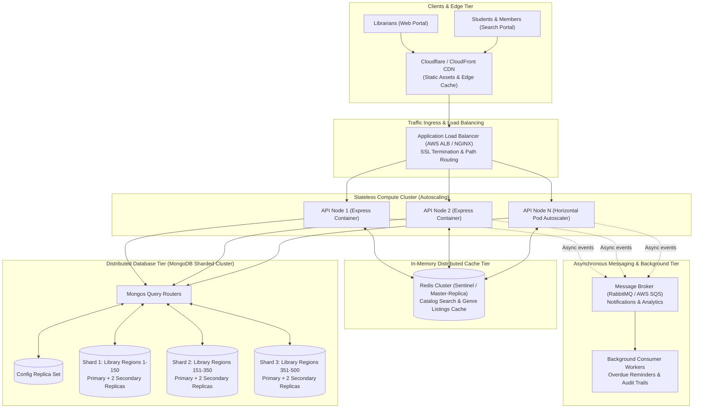

# ShelfLife — University-Scale System Design Specification

## 1. Executive Summary & Design Scenario

* **Scope**: 500 campus library branches across university networks.
* **User Base**: ~2,000,000 active students, faculty, and librarians.
* **Workload Characteristics**:
  * Steady state: ~500,000 daily catalog queries and ~50,000 borrow/return transactions.
  * **Peak Traffic (First Week of Semester)**: 10× surge (~5,000,000 queries/day; up to 1,500 requests/sec during peak morning registration hours).
  * High contention for core textbooks with limited physical inventory.

---

## 2. End-to-End System Architecture



### Architecture Component Responsibilities
1. **Edge CDN**: Delivers React SPA bundles, CSS, and static assets with near-zero latency, offloading ~85% of static traffic from origin servers.
2. **Application Load Balancer**: Distributes incoming HTTP requests using round-robin with least-connections health checking across stateless compute pods.
3. **Stateless API Cluster**: Dockerized Express.js containers running on Kubernetes (EKS/GKE). Containers hold no sticky sessions or local state; all session context is carried via self-contained JWT tokens.
4. **Redis Cache Cluster**: Absorbs catalog browsing and search spikes with sub-5ms latency.
5. **MongoDB Sharded Cluster**: Partitioned across multiple shards with secondary replica sets for zero-downtime failover and read scaling.
6. **Asynchronous Message Queue**: Decouples non-critical tasks (push notifications, daily overdue scans, analytics) so synchronous HTTP responses remain sub-50ms.

> **Critical Correctness Rule**: Core issue and return transactions are **never** offloaded to an eventually-consistent queue. They are executed synchronously against the primary database shard to prevent overselling inventory.

---

## 3. Database Scaling & Sharding Strategy

### Why Sharding is Required at Scale
A single replica set tops out on IOPS, write locks, and memory limits when managing 2 million members and tens of millions of historical borrow records. Sharding horizontally partitions collections across physical storage nodes.

### Schema Evolution: Introduction of `libraryId`
While the single-college MVP did not require tenant separation, university scale introduces `libraryId` as the core partitioning attribute representing geographical or campus boundaries.

### Shard Key Analysis & Trade-Offs

#### 1. `Book` Collection
* **Selected Shard Key**: `{ libraryId: 1, _id: "hashed" }`
* **Justification**:
  * **Locality**: Queries scoped to a specific library branch (the vast majority of operations) are routed to a single shard (**targeted query**), avoiding expensive broadcast ("scatter-gather") queries across all shards.
  * **Hotspot Prevention**: Combining `libraryId` with a hashed `_id` prevents write hotspots when large new batches of books are cataloged during semester prep.
* **Trade-Off**: Cross-campus inter-library loans require scatter-gather queries, but these account for `< 5%` of total campus traffic.

#### 2. `BorrowRecord` Collection
* **Selected Shard Key**: `{ libraryId: 1, memberId: 1 }`
* **Justification**:
  * Optimizes the primary query pattern: librarians viewing active loans and students viewing their personal history (`GET /api/members/:memberId/history`).
  * Concentrates all borrow events for a member within the campus shard where the loans originated.
* **Trade-Off**: Analytical queries spanning all 500 libraries (e.g., nationwide overdue metrics) require cluster-wide map-reduce or aggregation pipelines, appropriately handled by nightly background workers.

---

## 4. Most Read-Heavy Operation & Caching Strategy

### Identification
* **Operation**: Book search and catalog browsing (`GET /api/books?search=...&genre=...&page=...`).
* **Volume**: Represents ~75–80% of all HTTP requests. During peak registration, thousands of students search the same textbook titles simultaneously.

### Redis In-Memory Cache Design
* **Cache Key Formulation**:
  ```text
  books:{libraryId}:{genre}:{search_query_normalized}:{page}:{limit}
  ```
  *Example*: `books:campus_04:Technology:clean:1:10`
* **TTL Policy**:
  * Popular catalog and search queries: **60 seconds**.
  * Availability metadata: **30 seconds** (short TTL limits potential desynchronization with physical inventory).
* **Invalidation Strategy**:
  1. **Direct Invalidation**: When a book is added or edited (`POST /api/books`), flush keys matching `books:{libraryId}:*`.
  2. **Short TTL Expiration**: When an issue or return occurs, reliance on short 30–60 second TTL avoids complex multi-key wild-card evictions across thousands of cached query combinations, while ensuring near-immediate convergence with physical stock.

---

## 5. High-Concurrency Issue/Return at University Scale

### The Last-Copy Race Condition Problem
If two librarians issue the last physical copy of a book at the exact same millisecond:
1. Both read `availableCopies = 1`.
2. Both confirm `availableCopies > 0`.
3. Both write back `availableCopies = 0` and create a `BorrowRecord`.
*Result*: 2 loans created for 1 physical book.

### Primary Mechanism: MongoDB Atomic Conditional Mutation
ShelfLife guarantees consistency using single-document atomic operations on the primary replica:

```javascript
const updatedBook = await Book.findOneAndUpdate(
  {
    _id: bookId,
    availableCopies: { $gt: 0 }
  },
  {
    $inc: { availableCopies: -1 }
  },
  { new: true }
);

if (!updatedBook) {
  throw new ApiError(409, "No available copies of this book to borrow");
}
```

### Why This Mechanism Beats Alternatives
| Technique | Evaluation | Why Rejected / Adopted |
| :--- | :--- | :--- |
| **MongoDB Atomic Conditional Update** | **Adopted** | Native database engine write-lock guarantee. Zero extra infrastructure. Sub-millisecond latency. Works across unlimited stateless API containers. |
| **Distributed Locks (Redlock / ZooKeeper)** | Rejected | Adds latency (network round-trips to lock manager), introduces deadlock edge cases, and creates a single point of failure. |
| **In-Memory / Application Locks** | Rejected | Completely ineffective when 20+ stateless API instances run behind a load balancer; memory is not shared. |
| **Eventual-Consistency Message Queues** | Rejected | Makes synchronous user interactions asynchronous; librarians cannot receive instant physical loan confirmation. |
| **Multi-Document ACID Transactions** | Supported as extension | If creating `BorrowRecord` and decrementing inventory must be atomic across replica sets, multi-document transactions can be wrapped around the atomic decrement with rollback compensation. |

---

## 6. Managing the 10× Semester Traffic Spike (Cost Optimization)

To handle the 10× first-week traffic surge without paying for idle peak capacity year-round:

1. **Stateless Horizontal Auto-Scaling**:
   * API servers run as container pods managed by Kubernetes Horizontal Pod Autoscaler (HPA).
   * **Scale-Out Trigger**: Average CPU utilization exceeds 65% or request latency exceeds 200ms. Pods scale from 10 instances up to 100 instances in under 2 minutes.
   * **Scale-In Policy**: Cooldown stabilization of 10 minutes post-peak, scaling down compute nodes to baseline, saving ~70% of infrastructure costs over the remaining 51 weeks.
2. **Database Connection Pooling**:
   * API containers maintain managed connection pools (`maxPoolSize: 50`) with keep-alive to avoid connection storms during auto-scaling events.
3. **Read Preference Offloading**:
   * Heavy analytical queries and history browsing utilize `readPreference=secondaryPreferred`, allowing read replicas to handle search load while the primary handles mutating issue/return transactions.
4. **Rate Limiting**:
   * Token-bucket rate limiting applied at the load balancer (e.g., 60 requests/minute per IP) prevents rogue scraper scripts from degrading exam-week catalog responsiveness.
